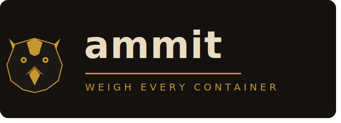

# ammit



**Weigh every container. Devour the unworthy.**

ammit is a lightweight container diagnostics and security CLI for Docker workloads. It inspects runtime configuration, network posture, performance metrics, and security risk from one static binary with no third-party Go dependencies.

## Why ammit

- Minimal operational footprint: static binary, scratch-compatible image, no runtime service.
- Fast operator loop: list, inspect, measure, recommend, and scan from one command surface.
- Security-first diagnostics: built-in misconfiguration checks plus optional Trivy CVE scans.
- Automation-ready: stable JSON envelopes, typed data payloads, deterministic error and exit codes.

## Table of contents

- [Capabilities](#capabilities)
- [Quickstart](#quickstart)
- [Command reference](#command-reference)
- [Streaming mode](#streaming-mode)
- [JSON and automation](#json-and-automation)
- [Security model](#security-model)
- [Brand system](#brand-system)
- [Architecture notes](#architecture-notes)
- [Roadmap](#roadmap)

## Documentation site

This repository now includes a full Docusaurus site under [website](website).

### Run locally

```sh
cd website
npm install
npm run start
```

### Build locally

```sh
cd website
npm run build
npm run serve
```

### GitHub Pages deployment

Deployment is configured via [deploy-docs.yml](.github/workflows/deploy-docs.yml).

To enable publishing:

1. In repository settings, open **Pages**.
2. Set **Source** to **GitHub Actions**.
3. Push to `main` (or run the workflow manually).

Expected site URL:

- `https://snellerz.github.io/Ammit/`

## Capabilities

| Command | Purpose |
|---|---|
| `ammit ls` | List target containers |
| `ammit config <target>` | Show image, env, mounts, capabilities, limits, restart policy |
| `ammit net <target>` | Show network mode, attached networks, bindings, live traffic counters |
| `ammit stats <target>` | Show CPU, memory, block I/O, and network usage |
| `ammit recommend <target>` | Produce tuning and resilience recommendations |
| `ammit scan <target>` | Run built-in security checks, optionally CVE scan |
| `ammit all <target>` | Run config, net, stats, recommend, and scan in one pass |

## Quickstart

### Build a native binary

```sh
CGO_ENABLED=0 go build -trimpath -ldflags="-s -w" -o ammit ./cmd/ammit
./ammit ls
```

### Build a container image

```sh
docker build -t ammit:latest .
```

### Run as a sidecar

```sh
docker run --rm \
  -v /var/run/docker.sock:/var/run/docker.sock:ro \
  ammit:latest all my-target-container
```

### Inspect in shared target namespaces

```sh
docker run --rm \
  --network=container:my-target \
  --pid=container:my-target \
  -v /var/run/docker.sock:/var/run/docker.sock:ro \
  ammit:latest net my-target
```

## Command reference

```text
USAGE:
    ammit [global flags] <command> [target]

GLOBAL FLAGS:
    -H, --host string              Docker host (default: $DOCKER_HOST or unix socket)
        --no-color                 Disable coloured output
        --json                     Emit machine-readable JSON output
        --cve                      In scan/all, also run CVE scan via trivy
        --watch                    Stream live stats (stats command only)
        --watch-interval duration  Refresh interval for --watch (default: 2s)
    -h, --help                     Show help
    -v, --version                  Show version
```

## Streaming mode

Use watch mode for continuous live metrics when debugging pressure, leaks, or throttling behavior.

```sh
ammit --watch stats my-target
ammit --watch --watch-interval 1s stats my-target
```

Notes:

- `--watch` is valid only with `stats`.
- `--watch` cannot be combined with `--json`.
- `--watch-interval` must be greater than `0`.

## JSON and automation

For machine consumers, add `--json`.

```sh
ammit --json ls
ammit --json config my-api
ammit --json scan --cve my-api
```

Envelope shape:

```json
{
  "tool": "ammit",
  "version": "0.1.0",
  "ok": true,
  "command": "scan",
  "target": "my-api",
  "output": "...human-readable output...",
  "data": {
    "config_summary": {"CRITICAL": 0, "HIGH": 1, "MEDIUM": 2, "LOW": 0}
  }
}
```

When `ok` is `false`, `error` is present:

```json
{
  "ok": false,
  "error": {
    "code": "AMMIT_E_TARGET_NOT_FOUND",
    "message": "no container matching \"api\""
  }
}
```

Stable error codes:

- `AMMIT_E_INVALID_FLAGS`
- `AMMIT_E_UNKNOWN_COMMAND`
- `AMMIT_E_TARGET_REQUIRED`
- `AMMIT_E_TARGET_NOT_FOUND`
- `AMMIT_E_TARGET_AMBIGUOUS`
- `AMMIT_E_DOCKER_HOST`
- `AMMIT_E_DOCKER_CONNECT`
- `AMMIT_E_DOCKER_API`

Exit codes are deterministic for CI, scripts, and chatops wrappers.

## Security model

Built-in checks run without external tools:

- Privileged mode and host-namespace exposure.
- Root-user execution posture.
- Dangerous capability additions.
- Sensitive host mounts (including Docker socket).
- Read-only root filesystem and no-new-privileges posture.
- Public bind exposure on all interfaces.

Optional CVE mode:

- Add `--cve` to `scan` or `all`.
- Uses Trivy if available on PATH.
- Falls back gracefully when Trivy is absent.

Verdict labels in terminal output follow brand language:

- `DEVOURED` maps to critical findings.
- `WORTHY` maps to pass findings.

## Brand system

Brand assets included in this repository:

- Brand system sheet: [assets/branding/ammit_brand_system_sheet.html](assets/branding/ammit_brand_system_sheet.html)
- Wordmark lockup: [assets/branding/ammit_wordmark_lockup.svg](assets/branding/ammit_wordmark_lockup.svg)

Core palette:

- Obsidian: `#14110E`
- Judgment gold: `#C8972E`
- Ma'at parchment: `#E9DCC0`
- Heart crimson: `#A32D2D`

## Architecture notes

- Uses Docker Engine API over unix socket or remote daemon endpoint.
- Uses standard library HTTP client and typed subsets of Docker payloads.
- Handles cgroup v1 and v2 memory accounting.
- Maintains deterministic output ordering for maps to support diffing and automation.

## Roadmap

- Kubernetes targeting with ephemeral debug workflows.
- containerd and CRI backend support.
- Structured JSON schemas published under a versioned docs path.
- Optional output profiles for human, compact, and CI-focused rendering.

## License

Distributed under the Apache License 2.0. See [LICENSE](LICENSE).
